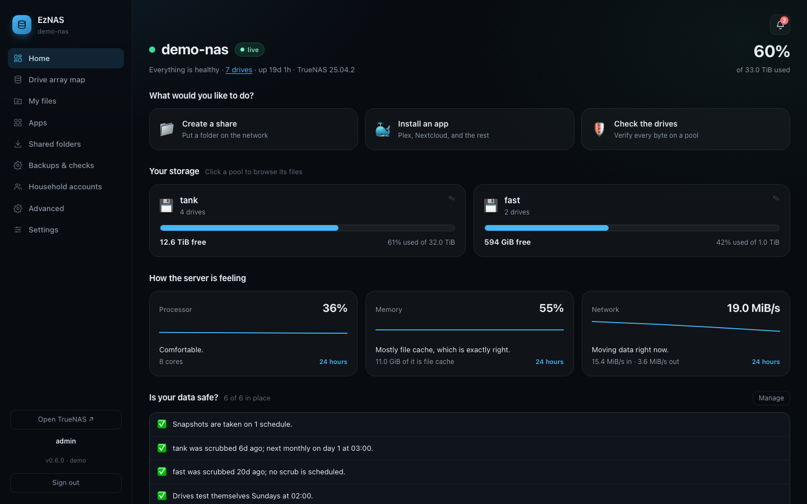
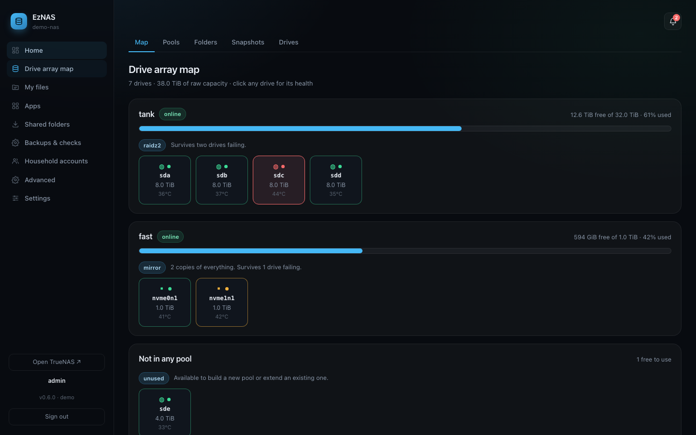
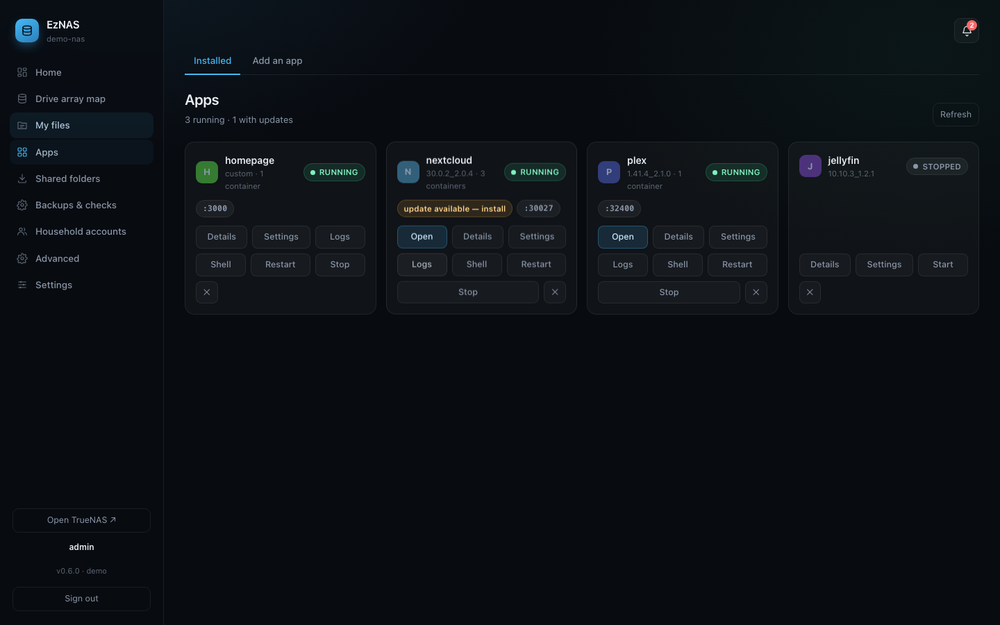
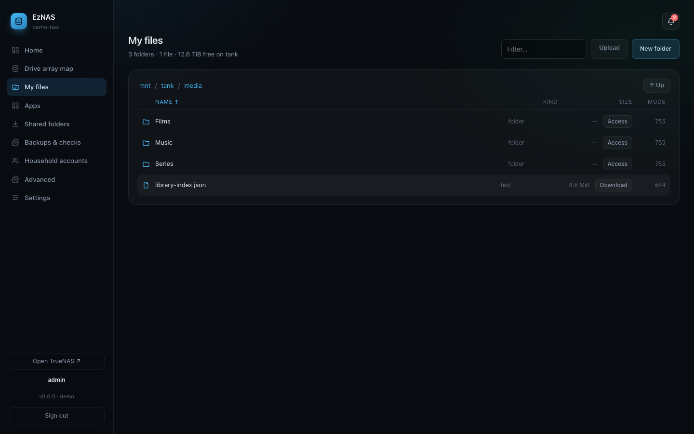
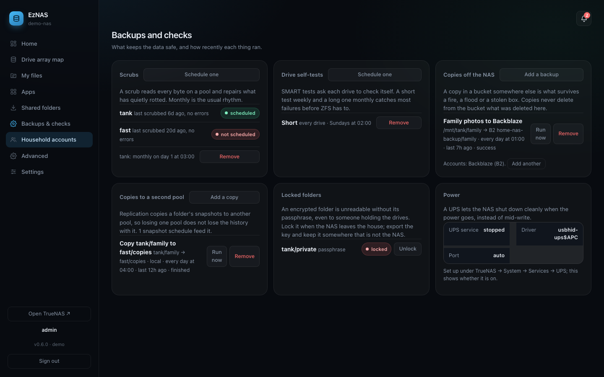

# EzNAS

A beautifully simplified, open-source web UI for TrueNAS. Built for homelabs, powered by WebSockets.

TrueNAS ships an interface built for storage administrators. This is one built for the person who
owns the box: pools you can read at a glance, apps as icons rather than a count, a file browser that
can actually move and delete things, and notifications for the situations TrueNAS stays quiet about.

**v0.5 — early.** Used daily against real hardware, and still young enough that you should read
[Security](#security) before putting it anywhere the internet can reach.

[Changelog](CHANGELOG.md) · [Contributing](CONTRIBUTING.md) · [Reporting a vulnerability](SECURITY.md)

<p align="center">
  
</p>

<table>
  <tr>
    <td></td>
    <td></td>
  </tr>
  <tr>
    <td></td>
    <td></td>
  </tr>
</table>

_Screenshots are of the console running against its own demo NAS (`npm run mock`), so nobody's real
serial numbers are in them. `npm run screenshots` regenerates them._

---

## What it does

**Home** — one screen answering "is it fine, and what do I want to do". Overall capacity, pool cards
with nicknames you choose, plain-language health ("Mostly file cache, which is exactly right"), your
apps as a logo grid, and three quick actions: share a folder, install an app, check the drives.

**Drive array map** — every physical drive drawn in its vdev, colour-coded, each explaining what its
layout buys you ("2 copies of everything. Survives 1 drive failing"). Click a drive for its health:
ZFS error counters, throughput, SMART attributes and self-tests, with a verdict in words first. Each
tile carries that same verdict, so a drive logging checksum errors is not green merely because ZFS
still calls it `ONLINE` — and a drive that reports no temperature says so rather than showing a gap.

**Storage** — pools, datasets, and snapshots you can actually take: create, clone, roll back, hold,
copy to another pool, and scheduled snapshots with retention.

**Files** — browse, preview images, video, audio, PDFs and text, create folders, rename, drag items
between folders, and set who can use a folder. **Upload** by dragging files in, with progress, a
transfer rate and cancel; a name that already exists asks before anything is overwritten. **Search**
the whole pool for a file when you cannot remember which folder it is in, streaming results as they
are found. Deleted items go to a per-pool **recycle bin**, which is a folder in the listing rather
than a button, and putting something back asks where: its original place, a new name, or a folder
you choose.

**Sharing** — put a folder on the network and say who may use it, in one step. The share and the
filesystem ACL are set together, because a share without permissions appears on the network and then
refuses everybody. Windows and Mac get **SMB**, which authenticates people; Linux and Unix get
**NFS**, which authenticates machines — so the dialog asks a different question depending on which,
and refuses to create an export that would be open to every device on your network.

**Apps** — install from the catalog through the app's own questions, then start, stop, update, open,
and edit configuration: a real form built from a catalog app's own schema, or the compose file for a
custom app. Open any app for its screenshots, description,
publisher and source. Apps deployed through TrueNAS's own "Custom App" button carry no catalog
metadata, so the console finds their logo by name and works out where to reach them from the ports
they publish. Plus a **Passwords** panel that digs out the credentials an app generated at install
and never showed you again.

**Backups & checks** — one page for what keeps the data safe: monthly scrubs, weekly drive self-tests,
nightly copies to Backblaze or S3, copies to a second pool, folders that lock with a passphrase, and
the UPS. Home carries an "Is your data safe?" card that says what is in place and what is missing,
with dates rather than ticks.

**Notifications** — the console runs its own checks every minute: pool health, capacity against a
threshold you set, drive temperature, ZFS read/write/checksum errors, apps stopping on their own,
scrub results, updates, and the NAS not answering. A standing condition is reported once, not once a
minute, and clears when it resolves.

**Also** — seven themes, per-account 2FA, a web terminal, network configuration with a rollback
countdown, SMTP, and restart or shutdown with the hostname typed back.

## Requirements

- **TrueNAS SCALE 25.04 (Fangtooth) or newer.** The console speaks JSON-RPC at `/api/current`, the
  interface TrueNAS's own UI uses, and never the REST API that 25.10 (Goldeye) removes. Each release
  says in its notes which TrueNAS versions it was run against; method schemas do change between
  TrueNAS releases, and a mismatch shows up as a sentence in the console rather than a crash.
- An API key for the console, made on the NAS under Credentials → Users. The first-run setup links
  to the page and tests the key as you paste it.
- To run from source rather than the image: Node.js 22 or newer.

## Install

Three ways. The first needs no shell at all.

**As a TrueNAS app**, from the NAS's own interface. Apps → Discover → Custom App → _Install via
YAML_, paste [`deploy/truenas-custom-app.yaml`](deploy/truenas-custom-app.yaml), change the one
line marked `CHANGE THIS` to a folder on one of your pools, save. TrueNAS pulls the image, starts
it, restarts it with the machine, and lists it under Apps. Open `http://<nas>:8080`: the console has
created an `admin` account and printed its password once in the app's log (Apps → EzNAS → Logs),
and will ask you to replace it before anything else. Updates are Apps → EzNAS → Update.

**From a shell on the NAS**, which does the same with Docker directly and keeps everything under
`/mnt/<pool>/eznas` so it survives a TrueNAS update:

```bash
curl -fsSL https://raw.githubusercontent.com/mexhi-byte/eznas/main/install.sh | sudo bash -s -- --pool tank
```

Replace `tank` with the pool to install into; leave `--pool` off and the script lists your pools and
asks. It pulls the published image — nothing is built on the NAS — and prints the first password.
Re-running it updates to the newest release with your data kept. `--ref 0.6.0` installs a
particular version, `--build` builds from source instead of pulling, and `--help` lists the rest.

The image is `ghcr.io/mexhi-byte/eznas`, built for amd64 and arm64 on every release, tagged
`0.6.0`, `0.6` and `latest`. It runs as `PUID`:`PGID` (1000:1000 unless set) and fixes the data
folder's ownership itself on start, so there is nothing to `chown`.

**From source**, for development or if you would rather not run a container:

```bash
git clone https://github.com/mexhi-byte/eznas.git
cd eznas
npm ci
cp .env.example .env    # then edit it
npm run build
npm start
```

Then open `http://<host>:8080` and sign in. If `.env` sets `UI_USERNAME` and `UI_PASSWORD`, those are the
first account. If it does not, the console creates an `admin` account with a generated password,
prints it once in its own log, and refuses to do anything else until you have replaced it.

### The first run

However it was installed, a console with no server yet asks five things in order instead of showing
an empty dashboard: where the NAS is (guessed, when the console runs on the NAS itself), whether to
trust the certificate it found there (shown in words and pinned by default), an API key (with a link
to the page on the NAS and a test as you paste), whether to add the account password that moving and
deleting files needs, and a summary. Nothing is saved until the last screen. Skipping it brings it
back next time, because a console with no server cannot do anything.

Run it under systemd for anything permanent:

```ini
[Unit]
Description=EzNAS console
After=network-online.target

[Service]
WorkingDirectory=/opt/eznas
EnvironmentFile=/opt/eznas/.env
ExecStart=/usr/bin/node dist/server/index.js
Restart=always

[Install]
WantedBy=multi-user.target
```

## Security

Read this part.

- **The console holds an API key with full control of the NAS.** Anyone who can reach it and sign in
  can do anything to your storage. Put it behind a VPN or an identity proxy; do not expose it to the
  internet on a password alone.
- **Console accounts are not NAS accounts.** They are local to this app, scrypt-hashed in
  `data/accounts.json`, with roles of `admin` or `viewer`. The viewer role is enforced at the API,
  not by hiding buttons — every non-`GET` request from a viewer is refused.
- **A viewer can still read every file** through the browser, because the console acts with the NAS's
  API key regardless of who is signed in. Folder permissions govern SMB, NFS and apps — not what the
  console itself can see.
- **The optional stored NAS password** is only needed for move, rename and delete, because TrueNAS's
  API has no call for any of them and they have to run as shell commands. It is AES-256-GCM encrypted
  at rest, never returned to the browser, and never reaches the shell's output or history. Leave it
  unset and the file browser stays read-only.
- **`SESSION_SECRET` is the encryption key** for stored credentials, derived by SHA-256. Set it with
  `openssl rand -hex 32` and treat it as a secret; changing it invalidates every session and every
  stored API key. If you do not set one, a random key is generated on first run and kept beside the
  data file as `<data file>.key` with mode `0600` — **back that up with your data, because without
  it the stored API keys cannot be read.**
- **Versions before 0.5.2 used a fixed key from the source** when `SESSION_SECRET` was unset, which
  means anything they wrote could be decrypted by anyone holding the file and a copy of this
  repository. Such data is re-encrypted automatically on first start. If a copy of your data file
  may already have left your machine, **rotate the TrueNAS API key and the account password** —
  re-encrypting does not un-leak what was taken.
- **The NAS certificate is pinned by default.** TrueNAS uses a self-signed certificate, so pinning is
  the only way this connection can be authenticated. The console looks at the certificate when a
  server is added, shows it in words with the fingerprint underneath, and remembers it unless you
  turn that off. A different certificate later is refused and reported, not silently accepted.
- **Behind a reverse proxy or tunnel, set `TRUST_PROXY=1`** so the sign-in rate limit sees the real
  client address from `cf-connecting-ip` or `x-forwarded-for`. Without it those headers are ignored,
  because anything can send them — and a lockout keyed on a header the client chooses is not one.
- **Destructive actions require typing the name** of what is about to be lost, and the API enforces
  that too — a mis-aimed script fails instead of succeeding on the wrong pool.

## How it talks to TrueNAS

Everything goes over JSON-RPC 2.0 on `wss://…/api/current` — the same interface TrueNAS's own UI
uses, and the only one that survives the removal of the REST API in 25.10. The live figures on Home
are a `core.subscribe` push about once a second, not a poll.

A few things have no API at all on 25.04: **moving, renaming, copying and deleting files**. Those go
through the NAS's shell WebSocket, quoted and confined to `/mnt`. See `server/nas-exec.ts` for what
that costs and how it is contained.

## Updating

Settings → App updates checks this repository's releases and shows what changed. What it can do
about it depends on how the console was installed:

- **As a TrueNAS app or through `install.sh`**: it runs from an image, which cannot replace itself
  from the inside. Update from Apps → EzNAS → Update, or re-run the installer. Both pull the new
  image; `data/` is a mounted folder and is untouched.
- **From a git checkout**: it can update itself in place. The current build is saved as `dist.prev`
  first, and `data/` is never touched.
- **From a release tarball**: each release attaches `eznas-vX.Y.Z.tar.gz` with `dist/` and
  `package.json`. Replace those and restart.

## Layout

```
server/     Node API. truenas.ts is the JSON-RPC client; index.ts is what is left
            of the routes, which are moving out of it a module at a time.
  routes/        the routes that have moved: files, shares
  http.ts        helpers every route needs, and the one place both sides may import
  accounts.ts    console users, scrypt hashes, roles
  secret.ts      the key stored credentials are encrypted with
  monitors.ts    the checks that generate notifications
  nas-exec.ts    shell commands, for what the API cannot do
  self-update.ts release checking and in-place update
web/        React front end, no framework beyond it. One file per page, named for it.
test/       vitest. Pure logic directly, routes against a NAS that records
            what it was asked to do, and against the mock over the real protocol.
mock/       A TrueNAS that is not there: every method the console calls,
            answered from fixtures. `npm run mock`, then add ws://127.0.0.1:18443
            with API key 1-mock. Also what the browser test runs against.
e2e/        Playwright. Sign in, set up, see every page — the test 0.5.0 lacked.
deploy/     The compose file for TrueNAS's Custom App button.
scripts/    release-notes.sh, which turns a changelog section into a release.
data/       Runtime state. Not in git, and not touched by updates.
```

Releases are made by pushing a `v*` tag that matches `package.json`. The release workflow builds
once, publishes the image for both architectures, attaches the tarball, and writes the release notes
from the changelog section. If the section is missing, the release fails rather than going out
blank.

A route module must never import from `server/index.ts`: it starts the server at module scope, so
importing it from something it imports resolves to a half-initialised object. Shared helpers live in
`server/http.ts` for that reason.

## Contributing

Bug reports and pull requests are welcome — see [CONTRIBUTING.md](CONTRIBUTING.md) for how the
project is put together and what it is trying to be. Two things worth knowing before you start: a
feature is not finished when its endpoint works, only when someone can reach it from the browser;
and errors here are meant to be sentences, not codes.

Security issues go through the Security tab rather than a public issue. See
[SECURITY.md](SECURITY.md).

## Licence

MIT. See [LICENSE](LICENSE).
